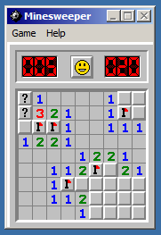

# Minesweeper Classic #

This is a browser-based clone of the Windows 2000 version of Minesweeper, written in JavaScript.
This implementation includes most of the features found in the real thing, including a functional classic Windows-style windowing environment (dubbed SweeperOS).

Minesweeper Classic can be set up by downloading the latest release ZIP and placing its contents on a directory of a web
server. The game can also be played locally, but at this time some browsers (namely IE/Edge) will not load the game due
to a known issue with HTML5 Local Storage being unavailable for local files
([#5](https://github.com/BrandonDusseau/minesweeper-classic/issues/5)).

A live demo of the latest release of the game is available [on my website](http://www.brandonjd.net/minesweeper/).

This project is licensed under the MIT License.

## Disclaimer ##

This project contains graphical and audio assets from the original Minesweeper game. These assets are the intellectual
property of Microsoft Corporation and are not covered by this project's license.
